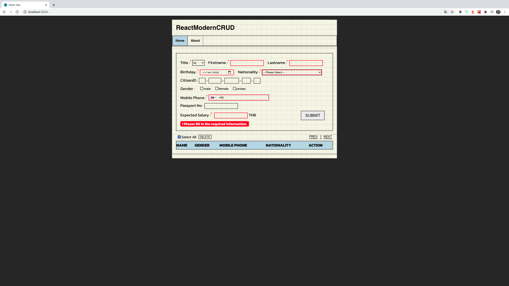

# ReactModernCRUD

### Preview

|    [หน้าแรก]()    | [validation input]() |
| :---------------: | :------------------: |
|  |     |

|  [ตารางข้อมูล]()  |  [select all]()   |
| :---------------: | :---------------: |
|  |  |

### Installation

Download and install [Node.Js](https://nodejs.org/en/download/) for install package.
<br/>

Clone this project with command

```bash
$ git clone https://github.com/thiraphat-ps-dev/ReactModernCRUD.git
```

Go to frontend directory and install package

```bash
$ cd ReactModernCRUD
$ cd frontend
$ npm install
```

Run server http://localhost:3000/ with command

```bash
$ npm start
```

### Enjoy this!
